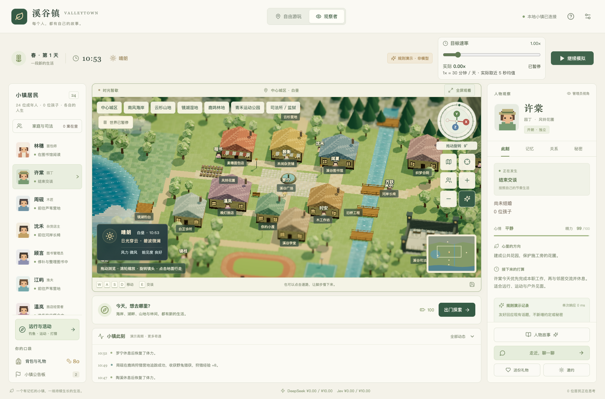
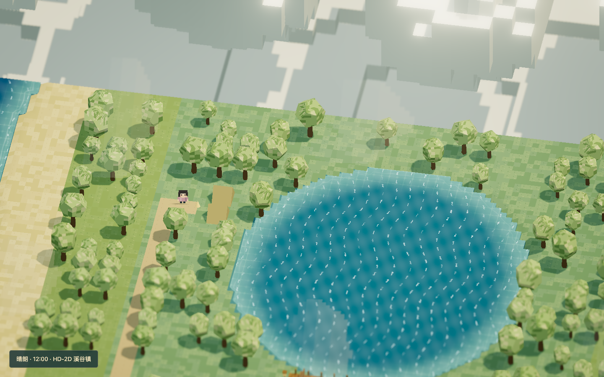
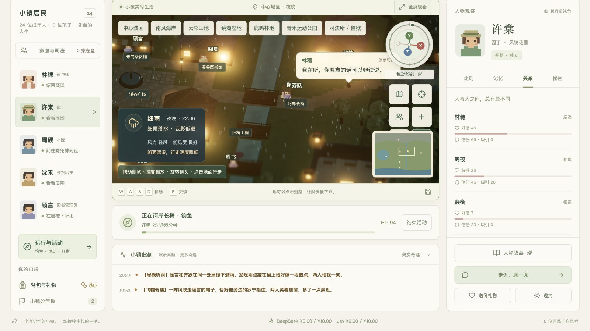
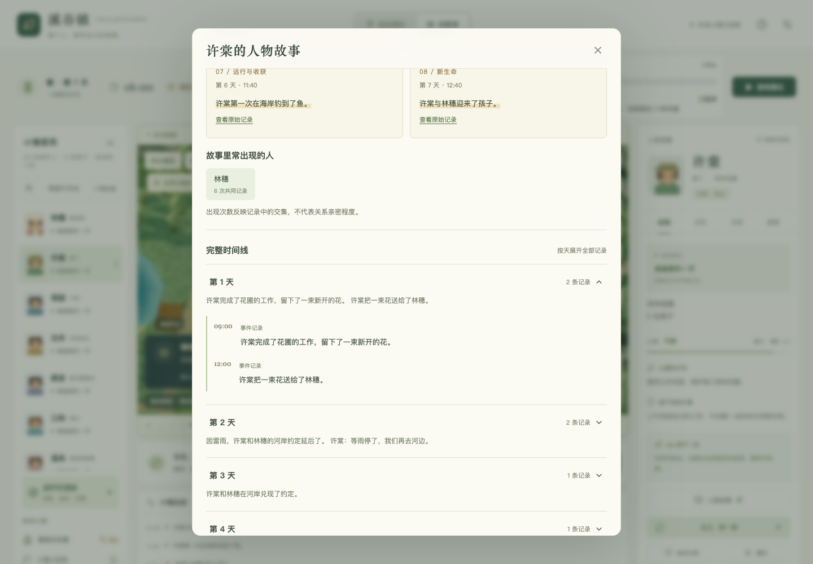
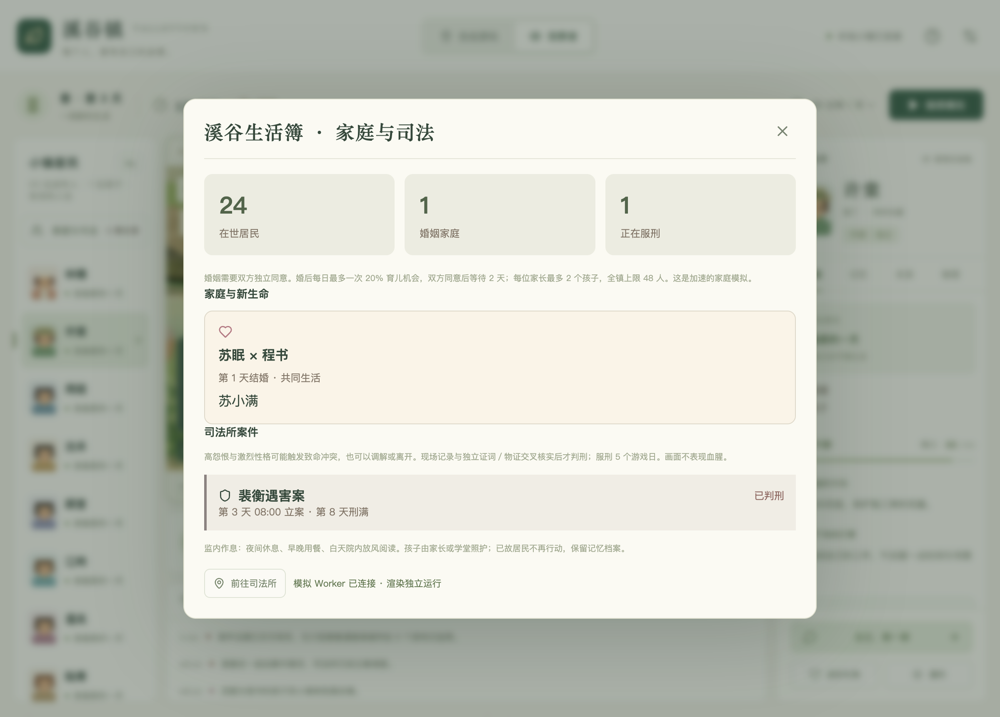
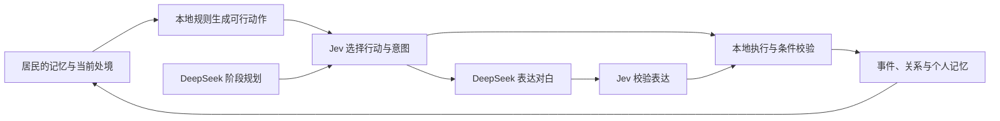

<p align="center">
  
</p>

<h1 align="center">溪谷镇 · ValleyTown</h1>

<p align="center"><strong>让 Agent 记住生活，再长出自己的故事。</strong></p>
<p align="center">一个可以走进去的 HD-2D Agent 小镇。24 位居民，各自的记忆，持续生长的关系。</p>
<p align="center"><em>A local-first agent town with individual memories and evolving stories.</em></p>

<p align="center">
  <a href="#快速开始"></a>
  <a href="#模型如何参与生活"></a>
  <a href="#快速开始"></a>
</p>

<p align="center">
  <a href="#走进溪谷镇">效果预览</a> ·
  <a href="#快速开始">快速开始</a> ·
  <a href="docs/README.md">文档导航</a> ·
  <a href="https://github.com/SleepinWei/ValleyTown/issues/new/choose">反馈与建议</a>
</p>

<p align="center">
  
</p>
<p align="center"><sub>当前版本实机截图 · 规则演示模式（非模型） · 世界在本机运行</sub></p>

## 这里的居民，会记得与你相遇

搬进溪谷镇，与园丁一起劳动，给面包师送一份礼物，或约上邻居去河岸坐坐。每一次交集都会留下记录，影响他们之后的选择。你也可以成为观察者，打开一位居民的记忆、关系与决策，看看故事如何一步步发生。

| 生活的一面 | 你能体验到什么 |
| --- | --- |
| **24 位初始居民，各自的人生** | 不同职业、性格、私人记忆与秘密；交流只传递实际说出的信息。 |
| **可以参与的关系** | 交谈、送礼、帮工、邀约与共同建设；居民会接受，也会拒绝。 |
| **六片区域，一座小镇** | 240 × 180 格世界，从中心城区走向海岸、山地、湿地、林地与运动公园。 |
| **会影响生活的天气** | 昼夜光影、细雨、大雾与雷雨；天气影响出行、体力和约会安排。 |
| **可以回看的故事** | 人物故事串起重要时刻与逐日经历，支持核对原始记录、导出 Markdown。 |
| **可以解释的决策** | 观察者可查看行动候选、概率、耗时与用量，在决策实验室比较模型选择。 |

## 走进溪谷镇

<table>
  <tr>
    <td width="50%">
      <a href="docs/slides/assets/cover.png"></a>
      <br /><strong>沿着湖畔，慢慢走</strong><br />像素角色与 3D 场景相遇，镜头支持旋转、缩放和全屏观看。
    </td>
    <td width="50%">
      <a href="docs/slides/assets/outdoor.jpg"></a>
      <br /><strong>把一天交给户外</strong><br />钓鱼、慢跑、篮球、登山与打猎，让行程留下收获和经历。
    </td>
  </tr>
  <tr>
    <td width="50%">
      <a href="docs/slides/assets/story.png"></a>
      <br /><strong>每个人，都有自己的故事</strong><br />从一次送花到一次赴约，沿着时间线回看相遇，追溯原始依据。
    </td>
    <td width="50%">
      <a href="docs/slides/assets/family.png"></a>
      <br /><strong>选择，会留下后续</strong><br />婚姻、育儿、冲突与司法，让关系变化进入持续运行的世界。
    </td>
  </tr>
</table>

<sub>点击图片查看大图。上方四张为项目已有演示素材，展示场景与功能；示例故事不代表真实模型每次运行都会产生相同结果。截图来源见<a href="docs/images/README.md">素材说明</a>。</sub>

## 快速开始

需要 **Node.js 22.13+**、npm，以及支持 WebGL 的现代浏览器。建议先用无需密钥、无模型费用的规则演示体验。

```bash
git clone https://github.com/SleepinWei/ValleyTown.git
cd ValleyTown
npm ci
```

首次安装时，将 [`.env.example`](.env.example) 复制为 `.env`，把其中一行改为：

```dotenv
MODEL_MODE=demo
```

其余配置保留默认值，两个 API 密钥可以留空；已有 `.env` 时直接编辑，不要覆盖。

```bash
npm run build
npm start
```

打开 **[127.0.0.1:3001](http://127.0.0.1:3001)**，点击「开始生活」。新世界默认暂停。

> **两种运行方式：** `demo` 使用本地规则，界面标注「非模型」；`live` 调用 Jev 与 DeepSeek，需要相应密钥和网络连接。已有存档会保留运行模式；切换时请暂停，等待在途请求结束，再到「设置」修改。

<details>
<summary><strong>接入真实模型</strong></summary>

在 `.env` 中填写：

```dotenv
MODEL_MODE=live
DEEPSEEK_API_KEY=你的_DeepSeek_密钥
VALLEYTOWN_JEV_API_KEY=你的_Jev_密钥
DEEPSEEK_BUDGET_CNY=10
JEV_BUDGET_CNY=10
```

重启服务；如果已有演示存档，再在「设置」中切换为真实模型。密钥仅由后端读取。

DeepSeek 与 Jev 使用独立的人民币金额池，默认各 ¥10；任一池不足以预留下次请求时，全局暂停。费用按本地单价估算，以供应商账单为准，详见[预算说明](docs/money-budgets.md)。真实模型模式下，筛选后的角色上下文会发送给相应供应商；本地存储不等于离线推理。

阶段规划与对白表达使用 DeepSeek `deepseek-flash`，高频行动判断使用 Jev `jev-1.13.0`。日终默认摘录真实经历；可通过 `DEEPSEEK_REFLECTION=true` 启用模型反思。

</details>

### 第一次来，可以这样玩

1. **认识一位邻居。** 点击居民名单，查看此刻的状态；选择「走近，聊一聊」与 TA 交谈。
2. **留下一次交集。** 送礼、帮工或发出邀约，再打开「人物故事」回看这次相遇。
3. **去镇外走走。** 点击「出门探索」，选择活动和目的地；装备可在杂货铺补给。
4. **换一个角度看生活。** 切到「观察者」，查看私人记忆、关系与决策记录。

<kbd>W</kbd> <kbd>A</kbd> <kbd>S</kbd> <kbd>D</kbd> / 方向键移动 · <kbd>E</kbd> 交谈 · 滚轮缩放 · 拖动浏览 · <kbd>Esc</kbd> 退出全屏

## 模型如何参与生活

**Jev 做当下的判断，DeepSeek 参与规划与表达，本地规则让选择真正发生。**



| 层次 | 实现与边界 |
| --- | --- |
| 世界呈现 | React 19 + Three.js；HD-2D 场景、天气、角色与头顶对白。 |
| 模拟与执行 | Fastify + Node `worker_threads`；寻路、时间、库存、关系和模型任务在独立模拟线程运行。 |
| 记忆与存档 | SQLite 保存运行状态，Markdown 提供人设编辑与可读记忆投影。 |
| 上下文隔离 | 每位居民保有独立上下文；听闻是个人认知，秘密按条件解锁。 |
| 可观察性 | 行动候选、实际选择、概率、调用耗时和费用账本可查；概率不等于正确率。 |

更多设计见[动作与规划](docs/action-policy.md)、[实时决策](docs/realtime-and-speech.md)与[决策实验室](docs/decision-lab.md)。

## 文档与开发

| 想了解什么 | 从这里开始 |
| --- | --- |
| 操作、存档、记忆编辑、暂停与重启 | [完整使用指南](docs/guide.md) |
| 地图、户外活动、光影与天气 | [世界扩建](docs/world-expansion.md) · [天气与渲染](docs/weather-and-rendering.md) |
| 故事、家庭与生活事件 | [人物故事](docs/character-stories.md) · [家庭与司法](docs/families-justice-workers.md) · [生活事件](docs/demo-incidents.md) |
| 模型决策与运行成本 | [动作策略](docs/action-policy.md) · [决策实验室](docs/decision-lab.md) · [人民币预算](docs/money-budgets.md) |
| 技术讲解与实测结果 | [演示文稿](docs/slides/README.md) · [实测记录](docs/current-system-live-measurement.md) · [模型对照](docs/system-replacement-comparison.md) |
| 参与开发或报告问题 | [贡献指南](CONTRIBUTING.md) · [提交反馈](https://github.com/SleepinWei/ValleyTown/issues/new/choose) |

```bash
npm run dev              # 后端 + Vite 开发服务器，打开 Vite 显示的地址
npm test                 # 核心规则、记忆隔离、预算、暂停与 API 检查
npm run build            # TypeScript 检查与生产构建
npm run check:simulation # 临时规则世界运行三个游戏日，无模型费用
```

真实模型冒烟检查会产生费用，运行方式和注意事项见[使用指南](docs/guide.md#验证与维护)。[浏览全部文档 →](docs/README.md)

## 当前范围

溪谷镇目前是持续迭代的本地单机原型，聚焦可玩的 Agent 社交与观察体验。建筑提供门前交互，尚无独立室内地图、完整种植季节系统或战斗；长期社交平衡与持续真实模型运行仍需校准。

服务仅绑定 `127.0.0.1`。「自由游玩」与「观察者」是本地管理员的视角选择，不是多用户权限系统。后端运行时世界可以继续生活；停止后不会补算离线时间。备份 `data/` 前请先停止服务。

仓库暂未指定开源许可证。

---

<p align="center"><strong>每个人，都有自己的故事。</strong><br /><sub>在溪谷镇，你的下一次相遇，也会成为某个人的记忆。</sub></p>
