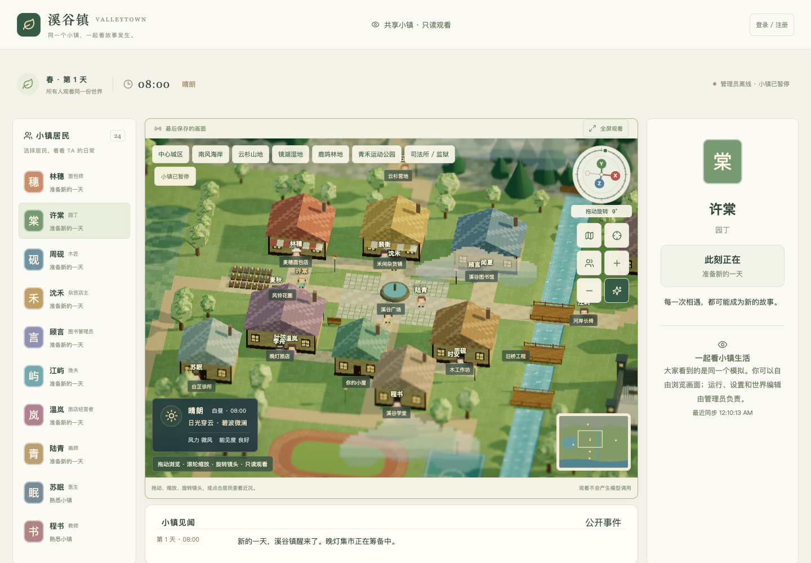

# 共享小镇 · 静态前端 + Supabase

[返回首页](../README.md) · [文档导航](README.md) · [在线体验](https://sleepinwei.github.io/ValleyTown/)

线上只有一个世界，所有人看同一个小镇。管理员在浏览器里运行模拟，Supabase 保存共享状态；观众只渲染画面，不启动模拟、不请求模型。静态网页部署在 GitHub Pages，无需常驻 Node 服务。



## 账号和权限

| 身份 | 可以做什么 |
| --- | --- |
| 未登录访客 | 与管理员使用相同的观察界面：地图、记忆、秘密、关系、故事、文档、决策与实验记录；可切换视角与镜头 |
| 普通账号 | 邮箱注册、验证与登录；同样只读观看 |
| 管理员 | 点击「进入管理」，运行 / 暂停模拟，修改设置、编辑文档、导入导出与恢复存档 |

管理员由部署者在数据库指定邮箱，必须完成 Supabase 邮箱验证。浏览器无法修改名单；`user_metadata`、自选用户名、注册先后顺序都不会授予管理权限。数据库 RPC 每次发布与取得运行权限时重新校验角色。模型代理也会检查管理员身份、当前运行权限及额度。

可恢复的完整存档与只读展示资料分表保存。游客和普通账号可以查看角色的游戏记忆、虚构秘密、对话、故事、文档、决策与已有实验；不能修改世界、聊天、生成故事、启动实验或请求模型。详情直接读取已同步的资料，点击查看不会产生新的模型调用。完整存档、账号凭据、API 密钥、内部配置及原始诊断错误不对外发布；数据库在发布时还会再次过滤凭据。浏览器隐藏按钮之外，数据库权限与模型代理也会拒绝非管理员写入和付费调用。

观看仍有正常的静态资源与 Supabase 数据流量；不新增模型调用不等于托管流量永远免费。

## 谁在运行模拟

1. 管理员登录后先以观看模式进入，点击「进入管理」取得运行权限。
2. 每次取得权限都从共享云存档载入，保持暂停；点击「开始生活 / 继续模拟」才推进。
3. 管理页面每 3 秒发布画面并保存完整世界。观众每 3 秒检查更新，只在版本变化时下载新画面，通常有几秒延迟。
4. 同一时刻只有一个管理员页面能运行。数据库用 120 秒租约与版本校验阻止其他标签页或设备同时覆盖世界。
5. 切换标签页不释放管理员权限、不主动暂停；后台继续心跳与同步。关闭页面或退出账号时，尽力保存并释放运行权限。浏览器休眠 / 断网使租约过期时，显示模拟连接暂停，观众仍能查看最后画面。
6. 普通切换标签页后可直接继续使用。真正失去运行连接时重新点击「进入管理」，以云端最后确认的存档为准。没有离线补算，也不会由普通观众代跑模拟。

登录状态由 Supabase 持久保存并续期，切换标签页、刷新或重开网站不会主动登出。账号登录与模拟连接是两件事：关闭浏览器后仍可保持账号登录，但浏览器不能在关闭后执行模拟。后台运行速度可能受浏览器节能策略影响。

**管理员关闭页面后不会继续后台运行。** 若需要全天候运行，需要另行增加常驻模拟执行器。突然关闭可能丢失最近一次成功同步后的进度；在途模型请求可能继续计费，费用由独立云端账本保留。

公开站点：[sleepinwei.github.io/ValleyTown](https://sleepinwei.github.io/ValleyTown/)；Supabase 项目 `jbdaxgonrvflwiwlxegt`，东京。`main` 推送后 GitHub Actions 自动测试、构建和发布。

## 本地开发

需要 Node.js 22.13+。访问者只需支持 WebGL、IndexedDB、Web Workers、Web Locks 的现代浏览器和 HTTPS。

```bash
npm ci
npm run dev
npm run build
npm start
```

不配置 Supabase 时为本机独立规则演示，使用 IndexedDB，不产生模型费用。配置 Supabase 后所有页面进入共享模式，不会自动上传旧访客或私人小镇。

## 数据库安装与迁移

新项目在 SQL Editor 按文件名顺序执行 [`supabase/migrations/`](../supabase/migrations/) 中的所有 SQL。也可使用 CLI：

```bash
supabase login
supabase link --project-ref YOUR_PROJECT_REF
supabase db push
```

已有项目只应用尚未执行的迁移。当前线上实例的初始化 SQL 曾通过 SQL Editor 执行，尚未登记初始化版本；后续迁移通过 MCP 应用。首次改用 CLI 前，先核对结构并修复迁移历史，避免重复建表。

| 数据表 | 用途 |
| --- | --- |
| `town_admin_emails` | 管理员邮箱名单，仅部署者可修改 |
| `shared_town` | 唯一共享世界的完整存档、版本与运行租约，仅管理员可读 |
| `shared_town_view` | 面向观众的公开快照，任何人可读，浏览器不能直接写 |
| `model_access` | 管理员账号累计调用额度 |
| `model_budgets` | 所有账号共享的供应商累计预算 |
| `model_requests` | 请求预留、结算与未知用量账本 |
| `town_saves` | 旧版私人存档，仅保留用于迁移恢复 |

写入通过受保护的 `claim_town_host` / `publish_town` / `release_town_host` RPC 完成。不要关闭 RLS，也不要把 service_role 密钥放进前端。

## 指定管理员

部署者执行下面的 SQL，将示例替换为自己的邮箱。管理员需在网页「登录 / 注册」设置自己的密码并完成邮件验证，**无需向部署者发送密码**。

```sql
insert into public.town_admin_emails(email)
values(lower('your-email@example.com')) on conflict do nothing;
```

管理员取得运行权限时，如果尚无 `model_access` 记录，自动配置两家各 ¥10 的账号上限；已有记录（包括禁用状态）保持不变。未验证邮箱、普通账号和访客都不会获得模型额度。

在 Supabase Authentication → URL Configuration 设置 Site URL 与 Redirect URLs 为实际前端地址。保留 Email 登录和邮件确认。

## 模型代理与费用限制

供应商密钥只放入 Edge Function Secrets；不要提交到 GitHub。示例本地未追踪文件 `.env.supabase`：

```dotenv
DEEPSEEK_API_KEY=your-deepseek-key
VALLEYTOWN_JEV_API_KEY=your-jev-key
ALLOWED_ORIGINS=https://your-town.example
JEV_USD_CNY=7
```

Origin 不带路径或末尾 `/`。然后：

```bash
supabase secrets set --env-file .env.supabase
supabase functions deploy model-proxy
```

`verify_jwt=false` 表示函数通过 `auth.getUser(jwt)` 主动校验当前用户，**不是匿名代理**。函数固定供应商地址、模型名、输入大小和输出上限。每次真实调用还必须满足管理员身份、有效的运行租约和两层预算。

- **项目累计预算：DeepSeek ¥10 + Jev ¥10，合计 ¥20。** 所有账号共享，不按天或按月重置，删除账号也不会退回项目用量。
- 账号预算与项目预算同时校验；按供应商加锁预留，防止并发突破额度。
- 单账号最多 20 个在途请求、每分钟 240 次。
- 按 UTF-8 字节数与额外余量预留输入费用，预留最大输出费用；完成后按实际返回用量结算。
- 未知结果保留预留。如果实际结算高于预留，自动停用对应供应商的新调用，等待部署者核对。
- 页面设置里的预算是额外模拟限制，无法提高数据库项目额度。

这是 ValleyTown 代理的应用预算，**不是供应商账户的账单封顶**。供应商单价变化、内部计费差异和同一密钥在其他应用的用量不受这里控制。本次没有修改供应商控制台的账户级限制。

查看额度：

```sql
select provider, enabled, limit_nano / 1e9 as limit_cny,
  used_nano / 1e9 as used_and_reserved_cny,
  greatest(limit_nano-used_nano,0) / 1e9 as remaining_cny
from public.model_budgets;
```

只有部署者可以调整 `limit_nano` 或关闭 `enabled`。不要为了恢复运行清空账本或重置 `used_nano`。管理员在网页设置中检查模型连接，暂停后切换「真实 Agent」。

## 前端部署

只给 Vite 配置公开连接参数：

```dotenv
VITE_SUPABASE_URL=https://YOUR_PROJECT_REF.supabase.co
VITE_SUPABASE_PUBLISHABLE_KEY=sb_publishable_your_public_key
```

`npm run build` 的产物为 `dist/`。GitHub Pages 通过仓库 Actions Variables 提供上述配置，子路径为 `VITE_BASE_PATH=/ValleyTown/`。Vercel 或 Netlify 同样使用构建命令 `npm run build` 与输出目录 `dist`。

改变环境变量需要重新构建；改变域名同时更新 Supabase Auth 回跳地址与模型代理 `ALLOWED_ORIGINS`。

## 旧存档迁移

不会自动把任意人的旧世界公开。管理员可以暂停模拟，在设置中导入自己确认要共享的 JSON 备份，导入后向所有观众发布公开画面。

旧 SQLite 存档：先停止旧 Node 服务、备份 `data/`，再执行只读导出：

```bash
npm run export:browser -- ./data ./output/valleytown-browser-save.json
```

备份包含角色私有记忆、秘密、文档和本地费用记录，请妥善保管。恢复世界不会撤销云端已发生的模型费用。单份共享存档上限 10 MB。

`server/` 保留用于旧数据迁移与回归测试的适配器；线上静态部署不运行它。

## 验证

```bash
npm test
npm run build
```

测试覆盖访客 / 普通账号 / 未验证管理员的权限、完整只读视图、客户端与数据库凭据过滤、排他运行、版本冲突、租约失效、角色撤销和模型预算。线上真实邮件注册与真实模型请求仍需要用户自行完成账号验证与配置供应商 Secrets。

数据库顾问会提示管理员名单 / 预算表没有客户端 RLS policy：这是有意拒绝所有客户端直读直写，仅由受保护函数访问。受保护的 SECURITY DEFINER RPC 具有固定 search_path 和明确身份检查。[RLS 检查说明](https://supabase.com/docs/guides/database/database-linter?lint=0008_rls_enabled_no_policy) · [RPC 权限检查说明](https://supabase.com/docs/guides/database/database-linter?lint=0029_authenticated_security_definer_function_executable)。

### 只读权限验证（2026-09-29）

已验证匿名用户不能发布、调用内部过滤函数或读取完整存档；普通账号不能接管模拟、发布世界或预留模型费用。展示资料在浏览器导出和数据库发布两处过滤凭据，保留虚构游戏秘密。

Supabase 安全检查中的管理员名单与费用表「RLS 无策略」是预期的默认拒绝；管理 RPC 的 SECURITY DEFINER 是为受控读写而保留，每次在函数内验证已确认邮箱的管理员身份与当前租约，普通用户拒绝测试已通过。参见 [RLS 提示](https://supabase.com/docs/guides/database/database-linter?lint=0008_rls_enabled_no_policy)、[公开 RPC 提示](https://supabase.com/docs/guides/database/database-linter?lint=0028_anon_security_definer_function_executable)及[登录 RPC 提示](https://supabase.com/docs/guides/database/database-linter?lint=0029_authenticated_security_definer_function_executable)。账号服务仍提示未开启 [泄露密码检测](https://supabase.com/docs/guides/auth/password-security#password-strength-and-leaked-password-protection)；本次没有调整账号策略或套餐。

完整展示数据较大时，发布过滤采用聚合构建 JSON，并先完整扫描已脱敏的 v2 视图；只有检测到可疑键名、凭据标记或原始错误时才走递归重建。约 1.8 MB 的线上视图实测过滤约 0.68 秒，避免旧实现触发 RPC 查询超时；权限校验和模型预算保持不变。
