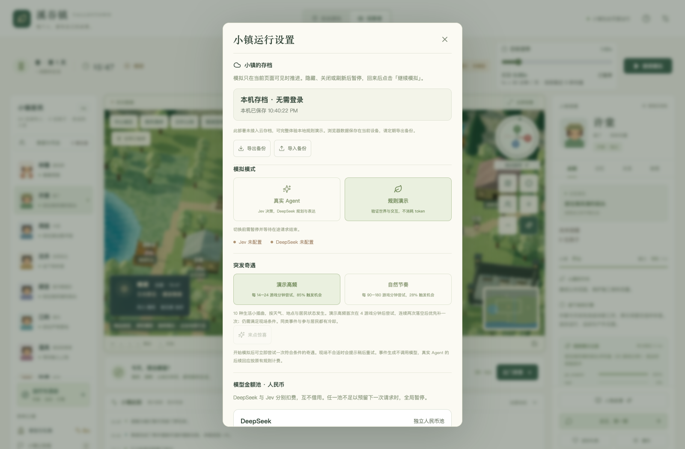

# 静态前端 + Supabase 部署

[返回首页](../README.md) · [文档导航](README.md)

溪谷镇的日常运行不再需要 Node / Fastify 服务。React 与 Three.js 在主线程呈现世界，Web Worker 执行模拟；IndexedDB 保存本机数据，Supabase 提供账号、云存档和模型代理。`npm run build` 生成的 `dist/` 就是完整前端。

## 页面与模拟的生命周期

- 打开页面，载入本机或账号存档，新旧世界都保持暂停；点击「开始生活 / 继续模拟」才推进。
- 隐藏标签页、最小化、切换到其他标签页或关闭页面后暂停。返回可见页面仍需手动继续，避免突然恢复付费请求。
- 浏览器休眠与离线时间不补算。同一浏览器中的同一个账号或访客存档由 Web Locks 保证只有一个页面持有。
- 模型已经收到的请求无法因关页撤销；云端在发出请求前预留额度，未知结果保留额度，已返回的请求按实际用量结算。页面隐藏后不派发新请求。
- 本机变更自动写入 IndexedDB；可见的已登录页面每 30 秒尝试云同步，也可手动「立即同步」。意外关闭可能丢失最近一次本机写入后尚未保存的瞬间，关页时云请求也不保证完成；跨设备前请点击立即同步。



*实机截图：未配置 Supabase 的规则演示，云端账号功能在配置后显示。*

## 1. 不配置云端，先试玩

需要 Node.js 22.13+ 进行开发和构建；部署后的访问者只需要支持 WebGL、IndexedDB、Web Workers 和 Web Locks 的现代浏览器，以及 HTTPS（localhost 开发可使用 HTTP）。

```bash
npm ci
npm run dev
```

打开 Vite 输出的地址。无需 `.env` 或模型密钥，规则演示不会请求供应商。

生产构建与本地预览：

```bash
npm run build
npm start
```

`npm start` 现在只预览静态网页，默认地址为 `http://127.0.0.1:4173`，不运行后台世界。

## 2. 创建 Supabase 项目并安装数据库

在 Supabase 新建项目，保留 Email 登录。设置 Authentication → URL Configuration 中的 Site URL 和 Redirect URLs 为前端站点地址；本地测试也添加相应 localhost 地址。默认开启邮件确认即可，用户确认邮件后回到网页用邮箱和密码登录。

在 SQL Editor 中执行：

[`supabase/migrations/202609280001_browser_town.sql`](../supabase/migrations/202609280001_browser_town.sql)

也可使用 Supabase CLI：

```bash
supabase login
supabase link --project-ref YOUR_PROJECT_REF
supabase db push
```

数据库包括：

| 表 / 函数 | 用途 |
| --- | --- |
| `town_saves` | 每个账号一份世界、历史、手动存档与编辑文档；RLS 限制为本人可读 |
| `save_town` | 以版本号比较并保存，防止另一设备静默覆盖 |
| `model_access` | 部署者授予的模型访问权限与人民币硬额度，浏览器不能修改 |
| `model_requests` | 云端请求预留与实际结算，独立于世界存档 |
| `reserve_model_request` / `settle_model_request` / `fail_model_request` | 仅 service_role 可执行的原子预算操作 |

不要关闭 RLS，也不要把 service_role 放进前端配置。

## 3. 部署模型代理

模型密钥只设置在 Edge Function Secrets。创建本地未追踪的 `.env.supabase`，内容如下；把示例替换为你的值：

```dotenv
DEEPSEEK_API_KEY=your-deepseek-key
VALLEYTOWN_JEV_API_KEY=your-jev-key
ALLOWED_ORIGINS=https://your-town.example,http://localhost:5173,http://127.0.0.1:5173
JEV_USD_CNY=7
```

`ALLOWED_ORIGINS` 填实际前端 Origin，逗号分隔，不包含路径或末尾 `/`。生产预览若使用 `4173`，也要添加对应 Origin。Supabase 自动提供 `SUPABASE_URL` 与 `SUPABASE_SERVICE_ROLE_KEY`。

```bash
supabase secrets set --env-file .env.supabase
supabase functions deploy model-proxy
```

函数配置中的 `verify_jwt=false` 表示由函数通过 `auth.getUser(jwt)` 主动校验用户，兼容当前签名方式；**不是匿名开放代理**。每次调用都必须有有效用户 JWT、已启用的模型权限与剩余云端预算。供应商地址、模型名称、输出上限由服务器限定，客户端不能任意代理 URL 或模型。

单用户最多 20 个在途请求、每分钟 240 次请求。云端 Jev 汇率来自 Secret，与界面中的本机估算汇率相互独立，调整时请保持一致。代理采用当前项目记录的保守单价；供应商改价时需要更新代理并核对实际账单。

## 4. 授予账号真实模型额度

先在前端创建账号、确认邮件并登录。新账号默认只有云存档能力，**没有共享密钥的调用权限或赠送额度**。

部署者在 SQL Editor 中执行下面的示例，为指定账号授予两家各 ¥10 的累计硬额度（`1 CNY = 1,000,000,000 nano-CNY`）：

```sql
insert into public.model_access(user_id, enabled, deepseek_limit_nano, jev_limit_nano)
select id, true, 10000000000, 10000000000
from auth.users where email = 'your-email@example.com'
on conflict(user_id) do update set
  enabled = excluded.enabled,
  deepseek_limit_nano = excluded.deepseek_limit_nano,
  jev_limit_nano = excluded.jev_limit_nano;
```

这设置的是累计额度上限，不会清空已用账本。若已经使用 ¥10，希望再追加 ¥5，请把相应上限改成 ¥15。关闭权限可将 `enabled` 改为 `false`。不确定用量的请求持续占用预留；确认供应商账单后由部署者处理，切勿为了恢复运行直接清空账本。

回到网页「设置 → 检查模型连接」，看到两家已配置后，暂停模拟、切换「真实 Agent」并继续。页面内的预算是额外的本机上限，即使修改或删除本机数据，也不能提高云端硬额度。

## 5. 配置并部署前端

将 `.env.example` 复制成 `.env.local`，只填写公开配置：

```dotenv
VITE_SUPABASE_URL=https://YOUR_PROJECT_REF.supabase.co
VITE_SUPABASE_PUBLISHABLE_KEY=sb_publishable_your_public_key
```

旧项目的 anon 公钥也可使用 `VITE_SUPABASE_ANON_KEY`。这些配置会写入静态文件，必须使用 publishable / anon 公钥，**不要填写 service_role 或供应商密钥**。

| 托管平台 | 构建命令 | 输出目录 | 额外设置 |
| --- | --- | --- | --- |
| Vercel | `npm run build` | `dist` | 选择 Vite，添加以上环境变量 |
| Netlify | `npm run build` | `dist` | 添加以上环境变量 |
| GitHub Pages | `npm run build` | `dist` | 仓库子路径需设置 `VITE_BASE_PATH=/ValleyTown/`；通过 Actions 上传 `dist` |

仓库已提供 [GitHub Pages 发布工作流](../.github/workflows/deploy-pages.yml)。在仓库 Settings → Pages 中选择 GitHub Actions，在 Settings → Secrets and variables → Actions → Variables 中设置 `VITE_SUPABASE_URL` 与 `VITE_SUPABASE_PUBLISHABLE_KEY`。推送 `main` 或手动运行工作流后，测试、构建与发布自动执行。工作流默认子路径为 `/ValleyTown/`。

本项目没有服务端页面路由。修改 Vite 环境变量后需要重新构建。最终域名确定后同步更新 Supabase 的认证 URL 和 `ALLOWED_ORIGINS`。

## 存档与多设备

访客和每个账号使用不同的本机存档空间，登录不会把访客的私人内容自动上传。若想把访客小镇迁入账号：先导出备份，再登录、暂停并导入，然后同步云端。

发现云端版本变化时，自动同步停止，模拟暂停。先「导出备份」保留本机进度，再展开「从云端重新载入」，按需使用云端版本；系统不自动合并两个不同进度的世界。换设备前请手动同步。

清除浏览器数据会删除访客存档和未同步的账号数据。JSON 备份包含居民记忆、秘密和故事，请按私人存档保管。单份导入 / 云存档上限为 10 MB；长期运行的完整历史与大量手动存档可能达到上限，届时本地保存仍保留并提示同步失败。

## 迁移旧 SQLite 存档

先停止旧 Node 服务，保留完整 `data/` 备份，再运行只读导出：

```bash
npm run export:browser -- ./data ./output/valleytown-browser-save.json
```

在网页「设置 → 导入备份」载入。迁移保留世界、事件、编辑文档、故事、实验记录及本地费用记录，旧数据库不改动。旧费用不会自动计入新 Supabase 项目的云端账本；部署者自行设置新项目额度。

`server/` 中保留的 Node 适配器用于旧存档迁移、历史基准脚本与回归测试，**前端部署不运行它们**。旧服务只有显式执行 `npm run legacy:server` 才会启动。

## 验证

```bash
npm test
npm run build
npm run check:simulation
```

本地测试涵盖页面生命周期、IndexedDB、模型代理鉴权 / 额度 / 异常、以及在 PostgreSQL 兼容运行时中执行实际 SQL 迁移并验证 RLS 与版本冲突。云端实际邮件、网络、供应商密钥和托管配置仍需部署后验证；使用规则演示可先完成不产生模型费用的验收。

参考：[Supabase 数据安全](https://supabase.com/docs/guides/database/secure-data)、[Edge Functions 认证](https://supabase.com/docs/guides/functions/auth)、[Supabase JavaScript](https://supabase.com/docs/reference/javascript/introduction)。
