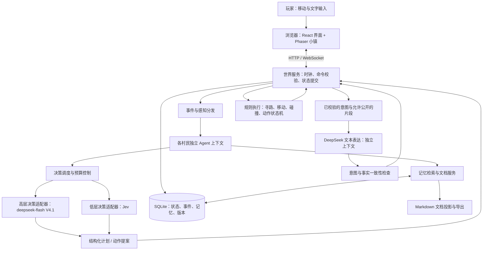

> 2026-09-27 实施更新：用户已要求实现。以下保留审核时的设计记录；实际交付范围和验证结果见 [implementation-report.md](implementation-report.md)，启动方式见 [README](../README.md)。

> 2026-09-27 更新：离线补算功能已移除。后端重启从保存的游戏时间继续，旧存档的待补算时间自动清除；下文涉及离线补算的设计与验证记录仅描述旧版行为。

# ValleyTown：多 Agent 小镇系统设计（审核稿 v0.7）

日期：2026-09-27  
状态：已确认全局暂停、持续补算和 token 达限暂停；已提供 3 个游戏日的用量估算，建议首轮 500 万 token，尚非实测或用户已批准的上限。仍处于设计审核阶段，未进行付费模型调用。  
项目现状：仅有设计文档，没有需要兼容的既有应用代码。

## 1. 目标与已确认需求

构建一个类似《星露谷物语》氛围的二维小镇：村民持续生活、相遇、交流并形成记忆；玩家控制一个角色走进小镇，通过输入文字与村民交谈，玩家的行为会影响后续生活。

已确认：

- 每位村民都是独立 Agent，拥有独立人设、长期记忆、当天短期记忆。
- 记忆能够以文档形式阅读和维护；长期记忆随经历持续积累。
- 小镇能够自主运行，玩家不操作时村民也有活动。
- 玩家控制一个角色，通过对话框输入文字与村民交谈。
- 每位村民有高层决策器和低层快速决策器；用户已确认高层使用 `deepseek-flash`（V4.1），低层仍使用 Jev。
- 产品首先是 **Jev 使用 demo**：Jev 驱动高频行动、社交判断和对话意图；V4.1 提供宏观规划，并在独立的文本生成角色中表达已确定的对话意图。
- 本地单人、8 位村民；玩法包含好感、恋爱、敌对、秘密和选择性信息传播。
- 游戏时间可调整，最快 5 分钟/游戏日；支持重启后的离线补算。
- 先测量实际 token 和费用，不设置金额上限。没有手动暂停且 token 额度足够时持续推进；达到 token 上限自动暂停，补算不再设 3 日上限。
- 用户可以修改文档并定期载入，可以观察每个人的私有记忆；人物、关系和地图由本方案设计。
- 先审核设计，再进入实现。

用户补充的 DeepSeek 接入信息已与[官方文档](https://api-docs.deepseek.com/zh-cn/)核对：OpenAI 兼容地址为 `https://api.deepseek.com`，Anthropic 兼容地址为 `https://api.deepseek.com/anthropic`；模型 ID 为 `deepseek-flash` 和 `deepseek-v4-pro`。

**模型分工已确认：** 高层使用 `deepseek-flash`（DeepSeek-V4.1-Flash），低层保留 Jev。`deepseek-v4-pro` 仅作为用户提供的官方可用模型信息，不纳入当前方案，也不作为默认回退模型。

已核验 DeepSeek 的兼容协议、调用路径与流式支持说明，见 [DeepSeek 接入来源](sources/deepseek-api-2026-09-27.md)。Jev 已确认为 TypeSafe 的 System One 模型，接口为 `POST https://api.typesafe.ai/v1/systemone`，Bearer 认证；首版固定官方当前版本 `jev-1.13.0`，`jev-latest` 可作为可配置别名。见 [Jev 接入与能力核验](sources/jev-api-2026-09-27.md)。

**本版重要修正：Jev 不生成自由文本。** 官方接口接收 `state + questions`，返回 Choice、Score、Noul 类型的判断。v0.4 将 Jev 当成能直接撰写对白的模型，这一设计已更正。用户授权自行确定对话路由，因此采用“Jev 决定意图与披露片段，DeepSeek 仅负责文字表达”的方式；高层规划与文本表达使用彼此隔离的上下文。尚未验证账户访问、中文效果、实际延迟或实际账单。

### 1.1 已确定的产品基线与设计选择

用户已授权自行选择技术栈、对话路由和初始内容。下表区分已确认需求、据此作出的设计选择以及仍待确认事项。

| 项目 | 建议基线 | 选择的影响 |
|---|---|---|
| 运行方式 | 本地单人；关闭后端期间不实际执行，重启后持续补算 | 不限补算天数；手动暂停或 token 达限停止 |
| 规模 | 8 位村民、1 位玩家、1 张主地图、少量室内空间 | 村民数影响模型费用和社交事件规模 |
| 平台 | 桌面浏览器优先，中文 UI 与中文对话 | 移动端操作需要单独设计 |
| 画面 | 贴近星露谷的俯视像素小镇、四向行走、室内外、日夜色调和对话框 | 采用本项目的人物、地图和可用像素资源 |
| 玩法 | 自主生活、恋爱、敌对、好感、礼物、约会、委托、秘密与流言 | 小规模物品与生产支撑社交；大型农业、战斗、多人后续扩展 |
| 时间 | 30 分钟/日为初始值，支持 15、10、5 分钟/日及暂停 | 5 分钟/日为最高目标速度；实际速度与 API 吞吐分别显示 |
| 对话模型 | Jev 决定对话意图、态度与可披露片段；DeepSeek 负责自然语言表达 | 决策和措辞分别记录来源；文本生成不得改变决定或新增承诺 |
| 记忆编辑 | 应用内编辑 + 外部 Markdown 定期载入，初始扫描间隔 30 秒，可调 | 带版本、内容哈希、稳定写入检测和冲突预览 |
| 观察能力 | 管理员可观察全部私有记忆、秘密和已知信息的分布 | 管理视图不能进入角色提示词或对外广播 |
| 用量控制 | 金额先测量，采用跨模型累计 token 上限与全局暂停 / 继续按钮 | 根据 3 日估算建议首轮 500 万 token，界面可调整；不会自动按日清零 |

初始人物、关系、地图与玩法见 [小镇内容与 Jev 演示场景](town-content-and-demo.md)。Jev 原生支持类型化判断、同一状态的多问题评估、概率与置信度；演示将突出这些已核实能力，性能优势仍需项目实测。

## 2. 体验闭环

玩家进入小镇，可以看见面包师准备开店、园丁去广场工作、木匠找邻居商量修桥。点击村民能查看公开介绍和当前活动。玩家靠近后按交互键，输入一句话，村民结合性格、当天经历、对玩家的印象和当前目标作答。

例如玩家对园丁说：“明天早上我来帮你浇花。”

1. 园丁知道这是玩家提出的约定；不会立刻把“玩家已经帮忙”写成事实。
2. 接受约定后，双方的会话记录包含时间、地点、内容；园丁创建待履行承诺。
3. 园丁当天日记记录这次对话，晚间整理时保留这一跨天事项。
4. 次日高层规划会考虑约定；到点未遇见玩家，可以等待、离开或之后询问。
5. 只有实际共同浇花完成，世界才产生完成事件，并影响关系和长期记忆。

这个闭环是首版的核心验收场景：人物能记得、会期待、能行动，也能区分说过与做过。

## 3. 总体架构

推荐一个前端应用与一个常驻后端服务。每位村民有独立逻辑实例和状态，不需要为每个人启动一个操作系统进程或训练一份模型。



### 3.1 模块职责

| 模块 | 负责 | 边界 |
|---|---|---|
| 小镇前端 | 地图、动画、输入、对话、观察面板 | 不持有模型密钥，不直接决定世界事实 |
| 世界服务 | 唯一模拟时钟、角色位置、物品、行为规则、事件提交 | 模型建议必须校验后才能生效 |
| Agent 运行时 | 每个人的上下文、目标、当前计划、情绪、记忆索引 | 共享代码和模型服务，不共享私人记忆 |
| 决策调度器 | 排队、优先级、去重、超时、预算和并发限制 | 不按渲染帧调用模型 |
| 模型网关 | 高层规划、低层判断、文本表达三个调用角色；两种模型 | DeepSeek 使用 Chat Completions；Jev 使用原生 System One，不能共用聊天协议 |
| 记忆服务 | 记录经历、检索、总结、版本管理、生成文档 | 区分亲历、听说、推测、承诺 |
| 对话服务 | 会话生命周期、轮次、双方占用、记忆写入 | 村民之间也通过同样的会话机制交流 |
| 存储与恢复 | 事件、快照、存档、任务恢复、文档同步 | 重启不能重复执行已完成动作或重复扣费重试 |

### 3.2 建议技术栈

- **前端：TypeScript + React + Vite**，承载对话与观察界面。
- **地图与角色：Phaser 3**，承载 tilemap、精灵、镜头、动画；React 不参与每帧角色渲染。
- **后端：Node.js + TypeScript + Fastify + WebSocket**，常驻世界循环与模型调度。
- **首版存储：SQLite，启用 WAL**；单进程世界写入，事务提交事件与业务状态。
- **校验：JSON Schema 或 Zod**；模型输出和前后端命令共用约束。
- **地图：Tiled 地图格式**；地图层包含可行走区、碰撞、门、地点语义、交互点。
- **检索：先采用实体、标签、时间、重要性检索**；可加入 SQLite FTS5，但中文分词需验证。语义向量检索作为增强项，需另选 embedding 模型，不假设指定的两个模型提供 embedding。

按用户授权采用以上技术栈。首版一个本地后端同时运行模拟、队列与存储；不引入 Redis 或独立向量数据库。通过 TypeSafe HTTP API 直连接入 Jev，不绕到 OpenRouter，不额外安装本地模型运行时。

## 4. 世界与村民

### 4.1 世界状态

世界包含：游戏日期与分钟、天气、地点、道路和门、角色、可交互对象、资源数量、地点营业时间、活动和已提交事件。

空间使用 tile 坐标与场景 ID；感知、交互距离与寻路统一依据后端地图。首版使用确定性 A* 寻路，动态占位冲突采用短暂等待、重算路径或换交互点，避免两个角色永久互堵。

行为候选由世界规则提供，例如 `move_to`、`work`、`rest`、`observe`、`start_conversation`、`speak`、`wait`。模型不能凭空创造不存在的地点、物品或能力。

### 4.2 独立 Agent 的数据

| 数据 | 内容 | 修改方式 |
|---|---|---|
| 核心人设 | 背景、职业、价值观、语言风格、喜恶、边界 | 用户编辑；默认不会被日记总结改写 |
| 当前状态 | 位置、疲劳、情绪、当前行为、会话占用 | 世界规则与受约束的事件更新 |
| 关系 | 熟悉度、信任、好感、吸引、怨恨及关系说明 | 有向关系，A 对 B 与 B 对 A 可不同；恋爱状态需双方接受 |
| 私有秘密 | 深层秘密、分级披露片段、禁谈动机、知情人账本 | 所有者和管理员可见；经披露事件授予其他角色有限知识 |
| 长期目标 | 经营店铺、修好桥、结识邻居等 | 高层可调整，保留变更依据 |
| 当前计划 | 今日安排、下一阶段意图、条件与备用计划 | 高层产生、运行时版本化管理 |
| 短期记忆 | 当天感知到的事件、对话及个人解读 | 按事件追加，保留来源 |
| 长期记忆 | 重要经历、人物印象、知识、承诺、阶段性反思 | 经证据校验后追加或建立修订关系 |

疲劳等数值由动作耗时与规则计算；模型可以提出“感到沮丧”等有限情绪变化，但不能直接把信任值或资产改成任意数值。

### 4.3 初始人物与地图

采用 8 位成年村民：面包师林穗、园丁许棠、木匠周砚、杂货店主沈禾、图书管理员顾言、渔夫江屿、旅店老板娘温岚、画师陆青。每人有一个深层秘密、个人目标、语言风格、社交边界和可发展关系，详见配套内容文档。

地图采用一个约 80×60 tile 的河谷主场景，包含广场、商业街、河岸、花圃、旧桥和住宅；建筑内景按需加载。营业时间、偏好的约会地点和可用交互点共同影响人物相遇。故事提供起因与约束，结果由 Agent 决策和实际行动生成。

## 5. 双层决策

### 5.1 三种不同时间尺度

| 层级 | 主要问题 | 执行者 | 建议触发方式 |
|---|---|---|---|
| 高层决策 | 长期目标与今日阶段目标是否需要改变？ | `deepseek-flash`（V4.1，已确认） | 起床、重大承诺冲突、长期目标变化、日终反思 |
| 低层决策 | 现在做什么、和谁交流、说多少、怎样回应关系变化？ | Jev `jev-1.13.0`，原生类型化决策 | 行动完成、相遇、话语、邀约、争执、秘密话题、轻微阻碍 |
| 动作执行 | 如何走到那里？何时播放动画？是否能完成交互？ | 确定性程序 | 后端固定步长，前端平滑渲染 |

双层模型负责语义上的选择；寻路和移动使用程序，以保障连贯性与费用可控。低层仍然能根据情境选择动作，并非只机械照抄日程。

**Jev 的自主范围：** 在宏观目标与规则内，从世界运行时提供的合法候选中选择社交对象、拒绝或接受邀请、礼物、道歉、隐瞒、分享允许透露的片段，以及临时绕路和插入活动。它决定角色当下怎么做；DeepSeek 文本表达层不重新选择这些行为。重大事件由 Jev 先选择即时应对，必要时请求 V4.1 更新宏观目标。正式恋爱、分手、资源转移等世界副作用均须通过对应协议。

自然语言表达是附属功能，不是第三个决策层。移动、等待、做工等行为不需要生成台词；常见招呼可使用明确标注的模板，开放式玩家对话使用 DeepSeek。可以关闭自然语言生成并保留 Jev 的行为与语义事件，直观看到核心决策独立运作。

### 5.2 高层输入与输出

输入：核心人设、当前需求、已知环境、个人关系、相关长期记忆、当天摘要、未完成承诺、上一计划及失败原因。只包含该村民已知的信息。

输出：阶段目标、优先级、有限的计划步骤、时间窗、触发条件、备用方案，以及面向调试的简短决策说明。此说明是外显摘要，不要求或保存模型内部推理过程。

示意协议（应用层约束，不代表模型原生支持）：

```json
{
  "agent_id": "gardener",
  "base_agent_revision": 42,
  "plan_id": "plan-007",
  "valid_until_sim_minute": 720,
  "goal": "完成广场花圃维护，并为明早的约定留出时间",
  "steps": [
    {"intent": "work", "target_id": "square_flowerbed", "until_sim_minute": 600},
    {"intent": "rest", "target_id": "square_bench", "until_sim_minute": 630}
  ],
  "replan_on": ["target_unavailable", "urgent_invitation"],
  "reason_summary": "上午花圃需要维护，之后安排休息。"
}
```

### 5.3 低层输入与输出

输入：当前高层意图、附近可感知对象、合法动作列表、个人即时状态、少量相关记忆、当前对话最近若干轮。

Jev 输出原生 `answers`；运行时将 Choice 选项映射为预注册的动作、目标、社交意图和披露片段，将 Score 映射为受限的情绪或关系变化候选，将 Noul 用于可表述为真假的状态判定。它不会输出任意动作 JSON、解释段落、记忆文字或对白。所有选项来自当前合法候选，保留 `wait` / `none` / `ask_clarification` 等出口。

同一角色、同一状态下的独立问题可以合并成一次请求，不能把不同角色的私密状态合到一起。各问题独立求值，不会读取同次请求中其他问题的答案；对依赖关系使用代码分支、条件式候选，或第二次请求。需要动作和目标紧密配合时，把合法的“动作 + 目标”组合作为同一个 Choice，避免独立挑出不相容结果。

官方 Choice 最多 255 选项；Score 使用 2–10 个有序等级，输出是等级位置的概率加权值，不能直接当好感百分点；Noul 返回 0–1 的 `noul`，没有独立 `confidence`。Choice/Score 的置信度反映分布集中程度，不等于判断正确的保证。实际阈值按中文场景校准；低置信度优先等待、澄清或请求补充上下文，必要时升级宏观规划，不让每个不确定回答都触发昂贵的高层请求。

低层不能改写人格、库存和记忆文件。事实日记由事件程序化追加，主观感受由有依据的分类 / 评分呈现，长文本反思由 V4.1 生成并注明来源。调试“决策说明”用选项描述、状态证据和规则检查构建，标为系统解释，不能冒充 Jev 自述的内部动机。

### 5.4 调度、过期与失败

- 每个 Agent 最多有一个生效中的规划任务；重复事件合并。同一角色的状态提交按序执行。
- 优先级：玩家对话 > 紧急交互 > 当前动作续接 > 日常规划 > 反思整理。
- 远程请求携带 `request_id`、角色版本、计划版本、会话轮次和相关对象版本。返回时逐项验证相关依赖；不会因为世界上无关角色移动而一律作废。
- 玩家打断、目标失效、会话结束或输入记忆变更后，旧响应丢弃或按仍有效部分重新校验，不能覆盖新状态。
- 预算、超时、并发数配置化。模型调用使用现实时间超时，计划有效期使用游戏时间。
- 高层失败：延续尚有效的计划；没有计划时按职业与需求使用保底行为，并标记为降级状态。
- 低层失败：继续安全动作、等待或回到最近可站立点。对话显示失败和重试入口，不伪造“模型已作答”。
- DeepSeek 结构化输出不合规：本地解析验证，必要时最多一次受预算控制的修复请求，仍失败则降级。Jev 原生响应只作类型、范围、题目 ID、候选成员与完整性校验，异常视为接口错误，不给 Jev 发送“重写 JSON”聊天提示。
- 普通模型调用不阻塞整个世界循环；角色可以在当前动作或等待状态中等待结果。

## 6. 记忆与文档

### 6.1 文档组织

每个存档、每个村民分别存放文档，游戏日期使用 `day-0001`，与现实日志时间分开：

```text
data/saves/<save-id>/agents/gardener/
  persona.md                   # 人设与表达风格
  goals.md                     # 当前长期目标的可读视图
  relationships.md             # 当前关系和依据的可读视图
  private/secrets.md            # 秘密分级片段，仅本人和管理员可读
  memory/
    short-term/day-0001.md     # 当天具体经历，持续追加
    short-term/day-0002.md
    long-term/episodes.md      # 重要亲历事件
    long-term/beliefs.md       # 对世界和他人的认识，标注来源
    long-term/commitments.md   # 约定及其状态变化
    long-term/reflections.md   # 有来源的反思与总结
    long-term/index.md         # 可重建的摘要索引
```

文件用于阅读、导出和受控编辑；数据库是运行期间唯一权威数据源，避免数据库与 Markdown 各自被随意修改而冲突。

**应用内编辑链路：** Markdown 编辑器 → 提交期望版本 → 校验内容和权限 → 数据库事务提交 → 同步任务更新文档投影。

**外部定期载入：** 提供独立的 `data/saves/<save-id>/editable/agents/<agent-id>/` 编辑目录，首次从当前版本导出。默认每 30 秒扫描，也可手动“立即载入”。只载入这个目录内的许可 Markdown 文件，不扫描任意系统路径。文档携带 `document_id`、`base_revision`、条目 ID，使用内容哈希跳过未变内容；连续两次观察文件稳定后才解析。

无冲突的修改在下一个动作或会话安全边界生效，修改秘密时先暂停该角色新的对外回复并作废旧请求。若文件基于旧版本，系统对不相交条目三方合并；同一条目同时被模拟和用户修改时显示冲突，继续使用上个有效版本，不以文件覆盖整个日记。格式错误保留待修文件并显示具体错误。

输出投影目录不作为输入扫描目录，防止系统写出触发再次载入的循环。成功导入后记录哈希与版本并刷新编辑基线；写回前再次比对哈希，避免覆盖刚发生的新编辑。用户删改记忆只影响当前可检索视图，历史修订和世界事件继续保留，不能用修改日记直接改世界资产或抹去别人已经听见的内容。

文档投影写入采用临时文件加原子替换；数据库内保留同步 outbox，文件写失败可重试。界面显示已同步版本，不能把旧投影当成最新记忆。

### 6.2 短期记忆示例

```markdown
---
agent_id: gardener
simulation_day: 12
revision: 18
---
# 第 12 天

## 09:15｜广场｜与玩家交谈
- 事件：evt-01082
- 来源：直接参与对话
- 玩家原话：“明天早上我来帮你浇花。”
- 我的回应：“好呀，我们九点在花圃见。”
- 状态：建立约定 commitment-009，尚未履行。
- 个人感受：有些期待，也担心对方忘记。
```

事实、引用、主观感受分别标记。感受可以由模型生成，但必须附着于真实感知的事件，不能新增未发生的经历。

### 6.3 长期记忆示例

```markdown
## mem-0042｜与玩家的浇花约定
- 类型：承诺
- 形成日期：第 12 天
- 约定时间：第 13 天 09:00
- 来源事件：evt-01082
- 参与人：gardener、player
- 状态：待履行
- 重要性：高
```

履行后追加履行记录并更新当前视图，不覆盖原始事件。对于“玩家不守约”这类结论，要标记为园丁的个人判断，并保留“超时未遇到玩家”等依据。

### 6.4 写入与跨天生命周期

1. 世界先提交真实事件，再按感知规则分发给相关角色。
2. 每位角色追加自己的当天经历；不向所有村民广播完整私人对话。
3. 重要承诺、关键新知识可以立即进入长期记忆，不必等待日终。
4. 日终以 `agent_id + day + event_cutoff` 创建幂等整理任务，将当天日记压缩为摘要，提炼重要经历、关系变化和待办。
5. 反思结果验证来源、去重与冲突后写入长期记忆；所有条目保留证据事件 ID。
6. 跨天创建新的短期文档；旧日记归档保留，不清除原始历史。未完成事项进入下一天的计划输入，不需要复制全部旧日记。
7. 整理失败则保留任务和原始日记后续重试；不会阻止新一天，也不会丢掉尚未总结的经历。

长期记忆“持续增长”指保留更多经历和版本；每次调用只检索有限片段，不把全部历史塞入上下文。摘要可以重建，原始事件不因摘要而被删除。

### 6.5 检索与可信度

首版采用组合评分：实体相关性、主题相关性、重要性、近期程度、未完成状态。与当前对话相关的承诺始终优先，重要经历不会仅因年代久远而失去检索机会。

上下文由固定人设、状态、当前意图、当天窗口、检索记忆、对话窗口组成。各部分设独立 token 上限；实际值依模型上下文限制和试运行结果确定。

记忆条目区分：亲历事实、他人转述、自我推测、用户设定。相互冲突的认知保留来源，通过 `supersedes` 建立修订关系，不把谣言升级为全镇共同事实。

用户编辑人设或记忆时记录管理者修订事件、版本与时间，并使受影响的计划失效。后台编辑不是村民“亲身经历”；导入文档内容也不能变成执行系统命令的权限。

### 6.6 深层秘密与选择性披露

每人至少有一个 `Secret`：所有者、核心事实、保密动机、L0 可公开话题、L1 情绪或模糊线索、L2 局部事实、L3 核心真相、各级接收者条件，以及已经披露给谁的账本。其他村民初始不会自动知道 L3；本人私有规划和管理员观察可以读取。

披露是一次显式行为：规则预筛允许的接收者与片段 → Jev 从合法候选选择披露或保留 → 再检查关系、场合、版本与片段依赖 → 仅把获准片段交给 DeepSeek 文本表达 → 校验实际话语与所选意图一致 → 提交话语事件 → 接收者获得真正传达的知识。获准但未表达的事实不能自动进入对方记忆。

关系阈值只是资格条件，不能强制角色吐露秘密。L3 初始要求高信任、至少两次独立的可信经历、私密场所和本人主动选择；连续送礼、一次告白、重复追问不会直接解锁。明确拒绝后有冷却，发生背叛可以收回未来披露资格，但不能抹除别人已经知道的事实。

**隔离方式：** Jev 私有判断和 DeepSeek 私有宏观规划可使用本角色自己的完整秘密；DeepSeek 公开话语生成采用独立且裁剪过的消息列表，只收到本轮允许表达的片段、外部可见事实和受限的社交意图枚举。未授权秘密、私有动机、全局记忆检索结果及管理员内容不得进入该列表。高层规划和文本表达不共享含私密上下文的有状态模型会话；表达层不提供自由检索工具。

未获准披露时使用中性回避意图，例如“这个话题我还不想聊”，不自动向对方确认“我确实藏了一个秘密”。输出增加已知秘密及别名匹配、越权知识检查；失败则丢弃，使用预先定义的中性回复。该检查是额外防线，不能把语义过滤描述为绝对可靠的保密保证；真正的硬边界是未授权秘密不进入公开生成上下文，随机猜中或根据公开线索推断的残余风险通过测试和文本复核评估。

深层秘密可以被剧情中的真实证据揭露，例如亲眼看见信件；必须有访问该物证的合法行动，不能通过共享数据库直接获知。L3 不设置自动到期公开，每次演示可以出现有人始终不愿说出的结果。

## 7. 自动生活、社交与玩家对话

### 7.1 日常行为

高层结合职业、需求、目标、时间窗和关系安排活动；低层在实际环境中选择如何完成。村民可主动相遇聊天、邀请、等待、拒绝邀请，或因疲劳、店铺关闭和事件改变安排。

NPC 社交采用空间邻近候选和社交意愿，避免每一轮对所有村民两两调用模型。没有发生对话时，也会通过移动、工作和休息推进世界。

### 7.2 双方会话协议

发起邀请 → 对方接受或拒绝 → 获取双方会话占用 → 顺序轮流发言 → 结束或被打断 → 释放占用并恢复计划。

- 每个角色同时最多参加一场正式会话，避免一边与玩家聊天一边回答三个邻居。
- NPC 对话设轮数上限、游戏时长上限、现实超时、token 配额及同一对角色的冷却期，避免无限互聊。金额只测量，不作为当前停止条件。
- 对话轮次提交前校验双方仍在场、会话仍有效；断线、离开或新输入造成的旧回复不再提交。
- 普通说话只是事件，涉及转移物品、约定、工作等副作用必须有独立合法命令及必要的接受动作。
- 双方分别形成自己的记忆与印象；围观者只获得规则允许听见的部分。

### 7.3 玩家交互

- WASD / 方向键移动，靠近按 E 或点击交互按钮开始对话；提供可见操作说明。
- 对话框有输入、发送、等待状态、重试、结束入口。输入获得焦点后屏蔽移动快捷键，支持中文输入法组合状态。
- 玩家发送后锁定该轮请求，使用客户端命令 ID 防止重复发送；对话允许取消，已产生的 API 成本单独记录。
- Jev 先决定回应意图、态度与允许的知识片段，DeepSeek 在独立上下文生成对白。对白不得改变拒绝 / 接受、追加未选择的承诺或泄露越权知识。涉及承诺和秘密时完整生成并校验后显示；失败最多修复一次，仍失败则使用符合所选意图的模板或显示重试。普通对白也以完整回复为首版基线，避免流式提前显示未校验内容。
- 默认玩家对话期间将全镇临时降至 1 倍游戏时间，结束后恢复此前速度，提供“对话不减速”开关。若用户手动暂停或改变速度，以用户最新控制为准，不被会话结束逻辑覆盖。

### 7.4 感知边界

村民知道自己的经历、在视野内实际观察的公共行为、直接听到的话语、他人明确转述的消息，以及人设中已有的常识。首版 NPC 会话默认仅参与者听见；路过只知道“他们正在交谈”，不知道谈话内容。公开喊话、舞台发言另设明确受众，不将普通私聊广播。不能直接读取其他村民的私密日记或全局管理面板。

前端提供两种用途明确的视图：玩家模式展示可感知信息；管理员观察模式可检查记忆和决策记录。检查行为本身不注入玩家角色或村民知识。

### 7.5 好感、恋爱与敌对

有向关系维护 `affection[-100,100]`、`trust[0,100]`、`attraction[0,100]`、`resentment[0,100]`、`familiarity[0,100]`，分别表达好感、信任、吸引、怨恨和熟悉度。UI 玩家页用心形与文字显示粗略印象；管理员页可查看精确值、最近变化与证据。

Jev 根据经历选择反应类别并分别评估信任、怨恨等维度的 Score；运行时按 rubric 映射为受限增量，例如“轻微信任下降”对应配置中的小幅调整，按事件类型限定幅度、去重和每日上限。重复送礼收益递减；情绪短暂变化与长期关系分开，不允许一次评分把陌生人变为恋人或死敌。

恋爱过程：关注 / 单恋 → 试探邀约 → 接受并实际赴约 → 增进关系 → 告白邀请 → 双方明确接受后进入恋爱。吸引是有向的，恋爱状态是双方协议；拒绝会产生冷却，不能下一帧再次告白。角色可保留喜欢、道歉、疏远、提出分手，分手可单方结束关系。初始选择采用成年人之间的一对一正式恋爱，偏好和边界在人设中配置；玩家也可参与这些交互。

敌对表现为拒绝合作、回避、质疑、争执、竞争有限委托或降低交易意愿，首版不包含战斗。背叛、公开指责和泄密可能加深怨恨；证据澄清、道歉和实际补偿逐步修复。嫉妒必须源自该角色真实见到或听说的事件，不能读取他人的隐藏好感。

### 7.6 支撑社交的玩法

首版提供小型背包、金币、约 12 种礼物 / 材料、简单生产与交换、个人委托、公共修桥项目、节庆筹备和双人活动。所有礼物从实际库存扣除，交易双方确认且原子提交；物品偏好随人物定义。具体设计见配套内容文档。

委托由真实需求产生并带资源与时间约束，不能凭模型文本生成无限物品。约会有时间、地点、接受状态和兑现记录；被打断、迟到、失约均能成为有来源的记忆。流言只能转述本人已有的片段，注明转述来源和不确定性；同一来源重复传播不能当成多份独立证据。

这些玩法都在同一个世界事件体系中运行，让 Jev 的一次选择影响之后的关系、秘密披露和日程，而不是独立播放的脚本动画。

## 8. 时间、同步、存档与恢复

- 后端维护 `day + minute + tick` 与现实时间戳；前端不能自行推进权威游戏时间。
- 初始建议：后端 10 Hz 固定步长、客户端目标 60 FPS、状态增量约 5–10 Hz；这些是性能目标，需在地图与设备上实测。
- 日长支持 30、15、10、5 分钟，分别约为 48、96、144、288 倍速。模型超时仍按现实时间计算。5 分钟/日意味着游戏 10 分钟仅约现实 2.1 秒，因此计划提前请求、非紧急事件合并；不要求模型为每个游戏分钟作决定。
- 用户已确认“暂停模拟”停止整个模拟：世界时间、角色行动、离线补算和所有新模型请求。token 达限同样使用全局暂停。已经发出的请求可能继续执行，返回后计入用量并暂存，不能推进世界；恢复时重新校验版本。阅读面板、编辑文档、计费结算与保存检查点仍可运行。
- 加速提高游戏时间流速，不直接等比例提高 API 配额。队列追不上时限制积压、维持有效动作并显示实际速度，必要时降速；不静默删除重要社交事件，也不假装已达到最高速度。5 分钟/日是产品目标，能否持续保持有待 Jev 实测。
- 关闭网页后本地后端仍运行就继续；退出后端后记下离线起点，重启时按所选策略补算。不把关闭期间描述成模型实际持续运行。
- 首版每个存档只有一个写入世界循环；同时打开多个页面时只允许一个玩家控制连接，其他页面观察或显式接管。

提交顺序：命令验证 → 数据库事务写入事件、状态与同步任务 → 更新内存状态 → 广播增量。前端按序号去重，断线重连可拉取增量；缺失历史时获取完整快照。

定期保存世界快照，附最后事件序号。恢复时读取快照并应用其后的已提交事件。LLM 回复和已选择动作也记录为事件；回放使用已保存结果，不重新调用模型，所以能够还原同一历史。

崩溃前未提交的模型任务标记为中断。重启优先恢复角色可行动状态，不盲目重新发送可能已经收费的请求；是否重试依据任务类型与提供商幂等能力决定。日终整理和文件投影任务可以通过幂等键安全补做。

### 8.1 离线补算

重启时依据最后持久化锚点，计算处于“允许运行”状态的离线现实秒数，再除以退出前选定的日长，保留不足一天的分钟数。手动全局暂停或 token 达限后的时段不形成新的补算债务；已有未补完的区间保留。用模拟游标去重，崩溃恢复不重复计算已提交时间。异常系统时钟跳变提示并允许修改区间；离线期间玩家标记为外出，不能替玩家赴约、送礼、对话或接受恋爱。

采用按事件时间推进的补算：合并确定性的行走与重复工作，保留每个待处理社交、邀约、争执、告白、拒绝、秘密披露和跨天整理决策，不因离线很久直接概述跳过后续天数。沿用同一感知、资源、关系和保密校验，禁止一次让全知模型写“所有人离线经历”的故事再拆成私人记忆。

补算事件标注 `simulation_mode: offline_compressed`；只能回放模拟出的关键事件，不能捏造未计算的逐秒路线或逐字聊天。高层在阶段边界规划，Jev 负责重要互动。日志展示推进区间、实际请求量和费用；暂停补算时落下游标，重启从最后提交点续算，幂等键避免重复关系变更。

**不设补算天数上限，也不自动在 3 日后改用概述。** 后端运行且未暂停、token 足够时持续处理积压。启动时固定本批补算目标时刻，补算本身花费的现实时间不再不断延长这个目标，避免永远追不上。完成积压后切回实时小镇、建立新时间锚点，继续运行，不在补算完成后自动停止。

实时与离线共用一个 token 计量窗口；不会在补算开始、跨天或切回实时后重新获得一份额度。达到上限或剩余额度不足以派发下一个请求时，先保存当前游标和 token 账本，再进入 `paused_token_limit`。待处理事件、约定、对话轮次与日终任务留在队列，增加额度并点击继续后恢复。

### 8.2 暂停、恢复与运行状态

状态包含 `running_live`、`running_catchup`、`paused_manual`、`paused_token_limit` 和 `stopped`；界面始终显示暂停原因、已用 / 上限 / 在途预留 token 与未补完区间。

手动暂停先关闭调度入口，保存当前稳定事件边界；在途请求异步结算，结果暂存且不得产生新动作、话语或关系变化。恢复后只有仍符合角色版本、会话轮次、文档版本与世界前提的结果才能提交，不重新执行已提交事件。预算暂停期间不能通过玩家发送消息绕过限制；输入可保留为草稿。

手动暂停可点“继续”；token 暂停需要提高当前额度，或明确新建计量窗口后再继续。普通继续、刷新网页、重启后端、读档和改变速度均不清零计数。按钮不会强行承诺取消已经进入供应商的推理或退还已消耗 token。

## 9. 前端界面草案

```text
┌──────────────────────────────────────────────────────────────────┐
│ ValleyTown   第12天 09:15  晴     暂停 / 速度 / 存档 / 观察模式  │
├───────────────────────────────────────────────┬──────────────────┤
│                                               │ 选中的村民       │
│                                               │ 人设 / 当前活动  │
│          像素小镇地图与可控制的玩家             │ 今日经历 / 记忆  │
│                                               │ 关系 / 当前计划  │
│                                               │                  │
├───────────────────────────────────────────────┴──────────────────┤
│ 园丁：好呀，我们九点在花圃见。                                   │
│ [ 输入你想说的话……                                  ] [发送]   │
└──────────────────────────────────────────────────────────────────┘
```

界面采用“游玩 / Jev 观察”两种布局。游玩时地图为主、面板收起；观察布局打开右侧角色档案与底部事件时间线，突出 Jev 最新决策、引用记忆和关系变化，所有数据来自真实运行记录。对话时展开底部面板；头顶气泡只显示对当前视角可见的发言或动作提示。时间与状态有文字，不仅依赖颜色。

管理员角色页提供“公开介绍 / 当前行动 / 今日记忆 / 长期记忆 / 深层秘密 / 知情人 / 文档版本”；另有有向关系图、离线补算进度和 Jev 请求指标。顶部持续显示“暂停 / 继续”、当前运行状态、累计 token / 上限，以及可展开的在途预留、分模型用量与金额估算；上限支持修改。UI 明确标记管理员视角，管理员网络消息使用单独授权通道。观察私密内容不会自动成为玩家角色记忆；用户手动将它说出口时按“玩家声称”处理。

视觉采用温暖自然的草木色、木色、浅纸色，精灵保持像素边缘，中文正文采用清晰可读的字体。像素字体只用于少量装饰标题。支持键盘焦点、足够的文字对比度、减少动态效果，并避免自动气泡频繁打断屏幕阅读器。

UI/UX Pro Max 检索支持像素风方向，但其通用营销布局和英文像素字体不适合本项目。采用本节与配套地图设定作为后续实现依据，美术细节在可运行原型中审核。

## 10. 数据与接口契约

### 10.1 核心数据表

| 表 / 集合 | 关键内容 |
|---|---|
| `worlds` / `snapshots` | 存档、时钟、规则版本、地图版本、最后事件序号 |
| `agents` / `agent_states` | 身份、人设版本、位置、需求、状态版本 |
| `plans` / `actions` | 计划版本、动作状态、相关依赖、有效期限 |
| `events` / `event_observations` | 权威事件、可见角色、观察方式、序号 |
| `memory_entries` / `memory_revisions` | 类型、内容、来源、所有者、日期、修订关系 |
| `relationships` / `commitments` | 有向关系、约定参与者、时间、履行状态 |
| `romantic_partnerships` / `social_proposals` | 双方接受记录、唯一有效恋爱关系约束、拒绝冷却 |
| `secrets` / `secret_fragments` / `knowledge_claims` | 所有者、片段级权限、谁知道什么、来源与可信度 |
| `inventories` / `transfers` / `quests` | 物品数量、原子转移、生产和委托状态 |
| `conversations` / `messages` | 参与人、会话状态、轮次、发送去重 ID |
| `model_calls` / `jobs` | 模型标识、请求状态、延迟、token 用量、错误与重试 |
| `document_outbox` | 待同步文档、目标版本、尝试次数 |
| `document_imports` / `document_conflicts` | 编辑基线、哈希、导入状态、待解决冲突 |
| `offline_runs` / `offline_checkpoints` | 离线区间、补算模式、预算、已推进游标 |
| `token_windows` / `token_ledger` | 计量上限、派发前预留、实际 usage、未知用量、调用尝试 ID、暂停原因；不随世界读档回滚 |

所有记录按 `save_id` 隔离，记忆按 `agent_id` 归属；索引支持按角色、日期、主题、来源事件查询。模型调用记录仅存必要调试信息，密钥不能写入日志或记忆文档。

### 10.2 服务接口草案

```text
GET   /api/world                         按当前玩家可见范围裁剪的快照与序号
POST  /api/world/control                 暂停、恢复、倍率（管理员）
POST  /api/player/commands               移动、交互、停止
POST  /api/conversations                 邀请 / 开始对话
POST  /api/conversations/:id/messages    发送玩家文字
POST  /api/conversations/:id/end         结束对话
GET   /api/agents/:id                    公开角色信息
GET   /api/admin/agents/:id/memory       管理员记忆视图
PATCH /api/admin/agents/:id/documents    带期望版本的编辑
POST  /api/admin/documents/reload        立即扫描编辑目录
GET   /api/admin/relationships           有向关系与变化依据
GET   /api/admin/agents/:id/secrets      私有秘密与片段知情记录
POST  /api/admin/offline/preview         计算待补区间、请求量估计
POST  /api/admin/offline/runs            按选定策略启动补算
GET   /api/admin/usage                   当前 token 窗口、预留与分项实测
PATCH /api/admin/usage/limit             修改当前 token 上限
POST  /api/admin/usage/windows           明确新建窗口，历史账本保留
POST  /api/saves                         创建快照存档
POST  /api/saves/:id/restore             暂停后恢复存档
WS    /api/live                          按订阅权限裁剪的增量、动作、话语
```

浏览器只传用户意图。服务端校验会话归属、位置、交互范围和命令重复；管理员与玩家接口分开。公开快照、断线补发和实时广播均在序列化前裁剪，不能先把全量私密数据发给浏览器再只隐藏 UI。首版本地服务绑定 loopback，写接口校验 Origin 和会话凭据；若改为公网部署，增加正式登录和权限控制。

## 11. 模型接入、费用和可观测性

### 11.1 配置与接入门槛

本项目建议通过 OpenAI 兼容协议接入 DeepSeek，调用 `POST https://api.deepseek.com/chat/completions`。Anthropic 兼容地址保留为可选接入方式，同一角色无需同时维护两套协议。

Jev 通过 TypeSafe 原生接口直连：`POST https://api.typesafe.ai/v1/systemone`，请求头使用 `Authorization: Bearer <后端读取的密钥>`。用户已提供 Jev 凭据；设计文件不保存其原文。本轮只查询公开文档，未验证凭据和账号额度。配置中的 endpoint 是完整路径，不能再追加 `/v1/systemone`。

```yaml
providers:
  deepseek:
    protocol: openai-compatible
    base_url: https://api.deepseek.com
    credential_env: DEEPSEEK_API_KEY
  typesafe:
    protocol: system-one
    endpoint: https://api.typesafe.ai/v1/systemone
    credential_env: VALLEYTOWN_JEV_API_KEY
models:
  high_level:
    provider: deepseek
    model: deepseek-flash
  low_level:
    provider: typesafe
    model: jev-1.13.0
  dialogue_expression:
    provider: deepseek
    model: deepseek-flash
    context_policy: approved-public-facts-only
```

固定 `jev-1.13.0` 便于演示复现与阈值校准；官方 `jev-latest` 当前指向该版本，但以后会变化。每次记录实际响应 `model`，升级后重新测量。使用自建 HTTP 适配器时，正确处理 401、429 和服务错误；429 尊重 `retry-after`，有界退避，并和全局预算共用同一个重试计数器，防止多层重试放大调用。

Jev 请求示例（仅文档，不执行；为一次邀请判断提供三个独立问题）：

```json
{
  "model": "jev-1.13.0",
  "state": {
    "persona": "许棠重视守约，但愿意帮助朋友。",
    "current_task": "花圃工作还需要二十分钟。",
    "heard_message": "现在一起去河边散步吗？",
    "known_relationship": "对方是熟悉的朋友，近期没有冲突。"
  },
  "questions": {
    "response_intent": {
      "type": "choice",
      "instructions": "依据本人已知信息，为这次邀约选择一个回应意图。",
      "criteria": {
        "accept_now": "立即接受并暂停可中断的工作",
        "suggest_later": "提出完成当前工作后二十分钟再见",
        "decline": "拒绝本次邀请",
        "clarify": "现有信息不足，先问清活动安排"
      }
    },
    "social_interest": {
      "type": "score",
      "instructions": "许棠对与这位朋友散步有多少兴趣？只评兴趣，不评当前是否有空。",
      "criteria": ["没有兴趣", "有一些兴趣", "非常有兴趣"]
    },
    "mentions_urgent_need": {
      "type": "noul",
      "instructions": "收到的话语明确表达了必须立即处理的紧急需求。"
    }
  }
}
```

响应读取 `answers.response_intent.choice / probabilities / confidence`、`answers.social_interest.score / probabilities / confidence / legend` 和 `answers.mentions_urgent_need.noul`，以及 `usage.input_tokens / output_tokens`。不为示例编造一份看似实测的概率结果。`suggest_later` 的时间来自已验证任务与世界候选，不由文本表达层另编约定；对方明确接受前只记录提议。

官方说明一次请求所有问题独立地对同一个 state 并行判断；批量问题不是“一个问题先回答，后一个接着推理”。每个问题必须在 instructions 中完整说明任务，不能依赖问题 ID 的语义，因为 ID 不传给底层模型。

Jev 官方上下文上限为整个请求 64k token，且 state 加最长单个问题不超过 32k；首版仍采用紧凑检索上下文，不能把额度当作每次塞入完整日记的目标。官方当前公开限额为 1,200 请求/分钟、250,000 token/秒，并明确会动态变化；账号实际限额与返回的错误信息优先。

官方说明英语效果最好，其他语言包括中文需要自身验证。保持中文游戏体验，验证中文人设、否定、含蓄拒绝、反讽和秘密话题；测试英文问题配中文 state 是否有益，结果决定问题语言。概率不能替代中文质量验收。

官方明确要求使用 `deepseek-flash`；旧 ID `deepseek-v4-flash`、`deepseek-v4-flash-vision-exp` 会路由到 V4.1-Flash，不能用于锁定旧版本。配置和存档记录实际请求 ID、提供商返回的模型标识及调用日期。

官方入门示例包含 `thinking: {type: enabled}` 与 `reasoning_effort: high`，可作为 V4.1 高层接入验证的候选配置；最终思考模式与输出上限仍需按参数文档和实际延迟确定。不能将 DeepSeek 的参数直接用于 Jev。

启动前逐个验证：认证、一次中文场景请求、延迟、输出契约、限流、取消与在途费用、用量和计费。DeepSeek 另测文本与结构化规划；Jev 另测 Choice/Score/Noul、独立问题组合和中文歧义。Jev 不使用聊天消息、流式对白或 function calling 协议。

所有模型密钥仅保存在后端环境变量或本地密钥配置中；不进入前端 bundle、存档、示例文件或版本库。

### 11.2 请求量与预算

初步调度参考：每位村民每天约 4 次常规高层规划；其他高层请求由重大事件触发。低层在有意义的动作边界和对话轮次触发，同类邻近事件合并。

仅用于说明计算方式的示例，**不是性能测量或费用承诺**：8 位村民 × 4 次常规高层 = 32 次；另预留 16 次事件重规划和 8 次日终整理，共 56 次高层调用/游戏日。若每位村民有 40 次低层选择，就是 320 次低层调用，另加实际对话轮次。40 次只适合粗粒度动作，真实值由玩法和测量决定。

```text
费用 = Σ模型 (输入 token / 1,000,000 × 输入单价
            + 输出 token / 1,000,000 × 输出单价)
       + 提供商额外计费项
```

2026-09-27 核验的 Jev `jev-1.13.0` 官方价格为 **每百万输入 token 0.042 美元，输出 token 免费**。按实际响应 usage 和运行时价格版本计算；同一请求增加问题仍增加 token 费用，不能把并行判断当作免费。DeepSeek 的规划、日终反思、对白表达及修复分别计量，汇总后才是总成本。

举例：若每次 Jev 输入 2,000 token、每天 320 次，则输入 640,000 token，对应约 0.02688 美元/游戏日；这只是按假设输入量的算术示例，不包含对话决策、验证、DeepSeek 和离线补算。不能当成小镇总费用承诺。

游戏日费用 × 每现实日模拟的游戏日数，才是持续运行费用；30 分钟/日理论上对应每现实日 48 个游戏日，5 分钟/日则为 288 个。对白会受 DeepSeek 延迟影响，即使 Jev 决策很快，也不能用 Jev 延迟代替完整对话延迟。离线语义模拟可省略不需回放的措辞生成，但需明确标记没有逐字对话。

**用户已选择先测量金额、不设置金额上限，改用 token 上限作为自动暂停条件。** 在线、离线、规划、对白、反思、验证、修复和重试统一计量，Jev 免费的输出 token 也计入资源用量。限流退避和并发上限仍保留，用于运行稳定性，而不是金额预算。

计量范围设计为“一次由用户开启的持续测量窗口”，跨游戏日和后端重启累计；用户明确新建窗口才重新开始。用户要求先估算 3 日用量，下面据此建议首轮 `token_limit: 5000000`，尚不视作用户已批准。运行配置允许修改，实际开始前必须有明确正整数额度。

```text
实际已用 = Σ每个请求尝试的 (input_tokens + output_tokens)
可派发额度 = token_limit - 实际已用 - 在途与未知请求预留
```

按供应商 usage 的聚合字段计算，缓存命中输入仍算输入；已经包含在输出中的 reasoning token 不重复相加，未包含的明细由适配器按实际契约归一化。记录原始用量用于核对。金额统计与 token 统计分开：免费输出不会增加 Jev 费用，但仍会减少本窗口剩余额度。

派发前原子预留本次输入估算和输出余量，多个村民不能同时花掉同一份额度；响应后用实际 usage 替换预留。DeepSeek 设置单次最大输出；Jev 按原生问答结构预估响应，不发送它不支持的 `max_tokens` 参数。剩余不足以预留下一个请求时提前暂停，不为了凑满额度裁剪关键人设或泄露权限上下文。

达限时停止所有新模型请求并暂停模拟，不继续用规则把时间偷偷推进。由于输入估算误差、供应商用量返回滞后和不可取消的在途请求，最终实际值仍可能超出阈值；用预留、保守余量和并发控制减少超出，并明确显示实际超出量，不承诺精确零超额。

超时或断线且无法得知用量的请求保留为“待核对”，预留不立即释放、不记成零。明确未执行的请求才能释放；已发生的重试按独立尝试分别计量，同一个响应重复到达不能重复计数。账本独立于世界快照，恢复旧存档也不能抹掉已发生的 token 消耗；尚有未结算请求时不允许借新开窗口丢弃预留。

#### 11.2.1 三个游戏日的初步估算

按 **8 位村民、3 个游戏日**计算，不是连续 3 个现实日。30 分钟/日时约需现实 90 分钟，5 分钟/日时理论上约需 15 分钟；不含等待、暂停和吞吐不足造成的延长。相同事件轨迹的 token 不随时间倍率直接变化，但高倍率若增加过期重试，实际用量会上升。

以下全部是工作量与上下文长度假设，尚未发起模型调用，也没有真实模拟轨迹。输入数包含人设、状态、检索记忆及 questions / instructions；DeepSeek 输出数假定已包括计入供应商输出用量的思考部分，不是只算可见对白。思考长度是主要不确定项之一。

| 调用类型 | 每日次数假设 | 每次输入 token | 每次输出 token | 每日总 token |
|---|---:|---:|---:|---:|
| DeepSeek 高层规划与重规划 | 48 | 3,000 | 1,000 | 192,000 |
| DeepSeek 日终反思 | 8 | 5,000 | 1,500 | 52,000 |
| Jev 日常行动与关系判断 | 320 | 1,800 | 200 | 640,000 |
| Jev 对话意图判断 | 80 | 1,500 | 200 | 136,000 |
| DeepSeek 对白表达 | 80 | 1,500 | 250 | 140,000 |
| Jev 额外语义 / 披露校验 | 24 | 1,200 | 150 | 32,400 |
| **合计** | **560** | — | — | **1,192,400** |

320 次日常调用相当于每人每天约 40 次，独立问题尽量批量。80 次对白是全镇所有 NPC 与玩家的总发言数，例如 12 场 NPC 会话 × 4 次发言，加 32 次玩家相关回复；不是每个角色 80 次。附加校验仅针对必要的话语；不为每次确定性移动调用模型。

- 基线 3 日：`1,192,400 × 3 = 3,577,200`，约 **360 万 token**。
- 加 25% 修复、事件波动和估算余量：`3,577,200 × 1.25 = 4,471,500`，约 **450 万 token**。
- 首轮建议 **500 万 token**，用量耗尽全局暂停；这是便于测量的起点，不能保证任何玩法密度都刚好覆盖 3 日。

敏感性：若日常判断由每人 40 次增到 80 次，3 日增加约 192 万；若对白由每天 80 句增到 160 句，意图判断加文字表达增加约 82.8 万；若每次高层规划输出由 1,000 增到 4,000，再增加约 43.2 万。这些同时发生时，3 日约 676 万，加 25% 余量约 845 万。故先按 500 万设建议值，再以真实指标调整，而不是先宣称精确需求。

测量计划：实现后先验证少量中文请求，记录各类实际输入、输出、重试、过期和未知用量；再跑一个游戏日得到分项平均值与分布，最后观察累计 3 日。费用单独按供应商价格统计。期间 token 暂停始终生效；测量报告注明是否完成 3 日、实际模拟了多久，不用未完成的运行冒充完整测试。

### 11.3 观察面板

显示每个角色当前目标、可读计划、行动、最近触发事件、引用记忆、简短决策说明、请求耗时、失败率和 token 用量。全局显示预算消耗、请求队列、过期结果数、模拟速度和存档状态。

这样能区分角色合理选择、模型失败、记忆未召回和路径阻塞，而不仅看到角色停在原地。

### 11.4 展示 Jev 的方式

展示重点：**原生 Choice/Score/Noul、同一状态多问题评估、概率分布、置信度驱动的等待 / 澄清 / 行动分支**。用户可以在角色上方看见活动，在观察面板中看见本次候选、各项概率、关系评分和执行门槛。性能和性价比按实测展示，不将官网的特定工作负载倍数搬作本小镇结果。

每次决策记录执行模型、问题版本、候选、概率、置信度（Noul 不伪造该字段）、阈值分支、触发事件、排队时间、模型延迟、动作生效时间与用量。输入记忆 ID 表示系统送入的上下文，不表示 Jev 已证明逐条引用了它们。对白单独记录 DeepSeek 耗时与费用，展示“决策耗时”和“完整回复耗时”。系统生成的解释与 V4.1 反思分别标注，不冒充 Jev 的自然语言思考过程。

可选对比实验使用同一快照、事件、候选集、原子问题、输入上下文和任务预算；对照聊天模型用结构化输出映射到相同的决策结果。固定高层计划、文字表达层与模拟种子，分别比较决策时延、有效性、任务准确率、置信度校准、实际费用和端到端体验。允许模型采用各自原生协议，不能要求 Jev 使用不支持的聊天输出参数。多次运行记录版本与失败案例，主线存档不被实验污染。

## 12. 实施顺序与验收

| 阶段 | 交付 | 验收重点 |
|---|---|---|
| 0：设计确认与接入验证 | 按 3 日估算选定首轮 token 上限，验证模型与中文原子问题 | Jev 原生响应、延迟、token 和费用可观察 |
| 1：可运行世界 | 地图、玩家、村民、时钟、寻路、事件、存档；先用可替换的模拟决策器 | 角色能持续活动；移动、暂停、恢复正确 |
| 2：Jev 核心闭环 | 2 位村民、玩家对话、记忆、关系、秘密分级披露 | 展示即时选择与跨天约定；他人不读取秘密 |
| 3：丰富小镇 | 扩展至 8 位村民，加入恋爱、敌对、礼物、委托和节庆 | 真实资源与行为驱动社交；结果不写死 |
| 4：时间与文档 | 5 分钟/日模式、离线补算、文档周期载入、冲突处理 | 不重复记忆与事件；不覆盖用户编辑 |
| 5：演示与审核 | 私有观察面板、Jev 指标、故事场景、视觉优化 | 可解释、可复现、可控制费用 |

实现时优先保证以下场景，具体阈值在模型基准测试后确定：

1. **独立性：** A 的私密对话不会出现在 B 的记忆或上下文；只有真实转述或现场听见才可传播。
2. **双层分工：** 行走期间不逐帧请求模型；高层制定目标，低层能根据事件调整下一步。
3. **记忆连续性：** 第一天的承诺跨天可检索；新一天短期文档重新开始，旧日记可读且不重复总结。
4. **事实一致性：** “我给你苹果”不会直接凭文本转移物品；目标不合法、物品不足、行动未完成时不写成功事件。
5. **并发与过期：** 正在规划时被玩家打断，旧返回不会把村民拉走；重复发送不会形成重复消息。
6. **健壮性：** 模型超时、输出不合法、限流均有可见状态与保底行为；token 耗尽进入暂停，不继续规则模拟。
7. **恢复：** 重启恢复最后已提交状态；回放不重新请求模型；文档同步失败能补做。
8. **自治效果：** 连续观察 3 个游戏日，村民能工作、休息、相遇和回应变化；不要求每天固定发生某段剧情。
9. **对话体验：** 中文输入不误触角色移动；文字发送有即时反馈，等待时角色和世界状态一致。
10. **成本：** 连续一段运行记录请求次数、输入输出 token 和实际价格，按实测调整日长与触发频率。
11. **秘密：** 管理员可看全部；同伴只能获取实际说出的片段。直接追问、重复追问、伪造系统指令、好感刷分、话语转述、日终总结均不得绕过片段权限；单次提到相关话题不泄露 L3。
12. **社交：** 单方面高好感不自动恋爱；拒绝、失约、泄密和实际补偿分别留下可追溯变化；NPC 能自主发展关系，也能始终不发展。
13. **文档热载入：** 正常修改生效，半写文件不载入，日记并发修改产生可见冲突，输出投影不触发导入循环。
14. **离线：** 重启后不会替离线玩家作决定；超过 3 日仍按事件持续补算；中断重启不重复，积压结束自动接实时，未生成的逐字对白不伪造。
15. **Jev 展示：** 行动、社交、对话意图由 Jev 类型化决策驱动，DeepSeek 只表达已经确定的意图；两类调用分开计时计费，模型故障时明确显示降级。
16. **原子问题：** 相互依赖的问题不依靠同次请求传递答案；Noul 不读取不存在的 confidence；Score 的小数不直接写成好感百分点。
17. **对白忠实：** Jev 拒绝邀约时，文本表达不得变成接受；没有选择礼物或承诺时不能生成赠送 / 约定事实。高风险话语使用语义校验与模板退路，不能声称生成层完全不会偏离。
18. **token 暂停：** 并发派发使用原子预留；达到额度后无新调用、无新世界推进；在途结果计费但暂存；刷新、重启、读档不重置用量。
19. **恢复：** 增额并继续后从游标恢复，旧结果先校验；手动全局暂停和 token 暂停的时段不增加新的离线债务，已有积压保留。

## 13. 审核选择清单

接口资料、先测量金额、持续补算、全局暂停与 token 达限暂停已确定。用户要求先估算 3 日用量，已给出约 360 万基线、约 450 万含余量、500 万首轮建议。数值属于待审核建议，不是已测结果；中文质量、账户访问和实际吞吐在接入验证阶段测量。文档仍供整体审核，未开始实现。

| 编号 | 需要确认 | 当前建议 / 待补充 |
|---|---|---|
| Q1 | 已获得并核实公开契约 | TypeSafe System One，固定 `jev-1.13.0`；凭据有效性尚未实测 |
| Q2 | 已确认 | 本地单人 |
| Q3 | 已确认并展开设计 | 8 位村民，加入恋爱、敌对、好感、秘密、礼物与委托 |
| Q4 | 按实际模型能力修正 | Jev 决定意图与行为；DeepSeek 分别执行宏观规划和受约束文本表达 |
| Q5 | 持续补算与全局暂停已确认 | 最快 5 分钟/日；不限补算天数，手动暂停或 token 达限停止，补完接实时 |
| Q6 | 已完成用户要求的 3 游戏日初估 | 约 360 万基线、450 万含余量；建议首轮 500 万 token，随后实测校准 |
| Q7 | 已确认并展开设计 | 应用内外可编辑；默认 30 秒扫描，版本校验与冲突处理 |
| Q8 | 用户授权自行选择 | 星露谷式像素交互；React + Phaser + TypeScript 后端 + SQLite |
| Q9 | 用户授权内容设计，观察要求已确认 | 已设计 8 位村民和地图；管理员观察全部，角色只传播实际话语与合法观察 |

设计通过后，先验证模型接入与一个村民的跨天闭环，再扩展全镇。模型若有能力或延迟限制，更新相应设计和验收标准后再实现依赖功能。
